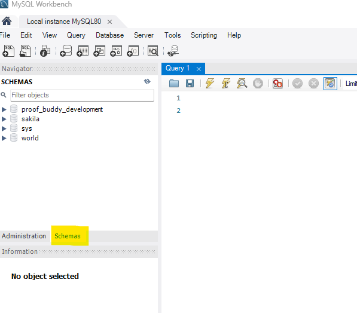
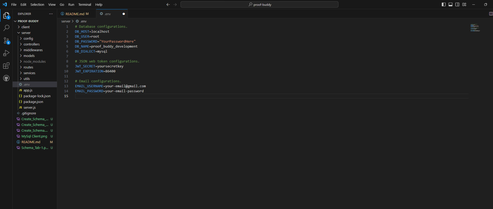

# Proof Buddy
A web application for verifying mathematical proofs using Truth-Functional Logic (TFL) and First Order Logic (FOL), currently utilized by professors and students in courses at Drexel University.

## Table of Contents
- [Prerequisites](#prerequisites)
- [Installation](#installation)
- [Setting up the Project](#setting-up-the-project)
- [Running the Application](#running-the-application)
- [API Reference](#api-reference)

## Prerequisites

Before starting with the installation process, ensure you have the following installed:

- [Node.js and npm](https://nodejs.org/en/download/)
- [MySQL](https://dev.mysql.com/downloads/installer/)

## Installation

### Node.js and npm

If you haven't installed Node.js and npm, follow these steps:

1. Go to [Node.js official website](https://nodejs.org/en/download/).
2. Choose the appropriate version (v18.18.2) for your OS and download it.
3. Run the installer and follow the installation process.

**OR**

Alternatively, install multiple Node.js using NVM [NodeWithNVM](https://www.freecodecamp.org/news/node-version-manager-nvm-install-guide/)

To verify the installation, open your terminal and run:

```bash
node -v
npm -v
```

### MySQL

1. Download the MySQL installer from [here](https://dev.mysql.com/downloads/installer/).
2. Run the installer and follow the setup process.
3. After installation, start the MySQL server.
4. Create a database (schema) for the application and make a note of the credentials. You'll need them to set up the backend connection. Like so:
    4a. 
    4b. 
    4c. 
    4d. 
    4e. 
    4d. Congratulations! You have succesfully created a Schema to for your database. Make note of any password you may have used, and the name of your Schema.


*Note: It's recommended to use a client tool like MySQL Workbench for easier database management.*

**OR**

For more information follow [this](https://www.w3schools.com/mysql/mysql_install_windows.asp) to install MySQL.

## Setting up the Project

1. Clone the repository:

```bash
git clone https://github.com/MarkNisarg/proof-buddy.git
```

2. Navigate to the project directory:

```bash
cd proof-buddy
```

3. Checkout to develop branch:

```bash
git checkout develop
```

4. Install the required dependencies for the server:

```bash
cd server
npm install
```

5. Install the required dependencies for the client:

```bash
cd ..
cd client
npm install
```


## Running the Application

1. Before starting the server, create and configure the environment variables in the `.env` file under /sever like so:
    1a. 
2. Make sure that DB_HOST equals "localhost".
3. Make sure DB_USER equal "root".
4. Make sure DB_PASSWORD equals the password you created when you installed MySQl Workbench. If you opted for no password, leave this an empty String.
5. Make sure DB_NAME equals the name of the Schema you created in MySQl Workbench. If you followed the tutorial, this will be "proof_buddy_development".
6. Make sure DB_DIALECT equals "mysql", which is the dialect the server will communicate with the database.
7. Make sure JWT_SECRET equals a secret key that you will not share on GitHub
8. JWT_EXPIRATION equals "86400"
9. EMAIL_USERNAME equals a email address that you wish to you. I strongly suggest creating a seperate email address, which is not linked to any other email you own for security.
10. EMAIL_PASSWORD equals the target email address you have provided.
11. Final note: Never push your .env file to Github or share it on any public forum. This will cause a security risk for yourself. Presently, the .gitignore is set up to ignore these files.

```
# Database configurations.
DB_HOST=localhost
DB_USER=root
DB_PASSWORD=""
DB_NAME=proof_buddy_development
DB_DIALECT=mysql

# JSON web token configurations.
JWT_SECRET=yoursecretkey
JWT_EXPIRATION=86400

# Email configurations.
EMAIL_USERNAME=your-email@gmail.com
EMAIL_PASSWORD=your-email-password
```

2. Start the backend server by opening a new terminal:

```bash
cd server
npm start
```
3. Start the frontend client by opening a new terminal:

```bash
cd client
npm start
```

## API Reference

A list of the User API endpoints and their functions.

### `/api/v1/auth/signup`

* `POST` : Register a new user.

### `/api/v1/auth/signin`

* `POST` : Sign in an existing user.

### `/api/v1/auth/verify-email`

* `GET` : Verify user email (query parameter: `token`).

### `/api/v1/users/profile`

* `GET` : Get profile of the logged-in user (authentication required).
