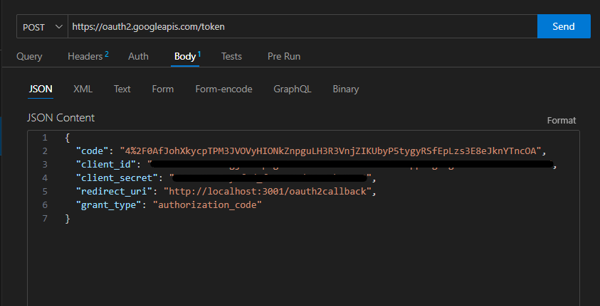

# Proof Buddy
A web application for verifying mathematical proofs using Truth-Functional Logic (TFL) and First Order Logic (FOL), currently utilized by professors and students in courses at Drexel University.

## Table of Contents
- [Prerequisites](#prerequisites)
- [Installation](#installation)
- [Setting up the Project](#setting-up-the-project)
- [Running the Application](#running-the-application)
- [Google Cloud & Configuring 'Consent Screen'](#Google-Cloud)
- [OAuth ClientID & Credentials](#OAuth-ClientID)
- [OAuth and env file](#OAuth-and-ENV-file)
- [API Reference](#api-reference)

## Prerequisites


Before starting with the installation process, ensure you have the following installed:

- [Node.js and npm](https://nodejs.org/en/download/)
- [MySQL](https://dev.mysql.com/downloads/installer/)

## Installation

### Node.js and npm

If you haven't installed Node.js and npm, follow these steps:

1. Go to [Node.js official website](https://nodejs.org/en/download/).
2. Choose the appropriate version (v18.18.2) for your OS and download it.
3. Run the installer and follow the installation process.

**OR**

Alternatively, install multiple Node.js using NVM [NodeWithNVM](https://www.freecodecamp.org/news/node-version-manager-nvm-install-guide/)

To verify the installation, open your terminal and run:

```bash
node -v
npm -v
```

### MySQL

1. Download the MySQL installer from [here](https://dev.mysql.com/downloads/installer/).
2. Run the installer and follow the setup process.
3. After installation, start the MySQL server.
4. Create a database (schema) for the application and make a note of the credentials. You'll need them to set up the backend connection. Like so:

<br>

5. Click the local Instance MySQL80 to open the your local instance.


<br>

6. Click the Schema's tab on the lower left side of the Local instance "navigator" window.

<br>


7. Right click the white space of the Schema Window, and select "Create Schema".

<br>


8. Type in the your Schema name in the new window. Name it something easy to remember, and press apply. Note: it is a good idea to name this Schema "proof_buddy_development".

<br>


9. You can confirm your Schema was created, by looking under the Navigator Tab of Schemas, you should see your named Schema.

<br>


10. Congratulations! You have succesfully created a Schema to for your database. Make note of any password you may have used, and the name of your Schema.
    

*Note: It's recommended to use a client tool like MySQL Workbench for easier database management.*

**OR**

For more information follow [this](https://www.w3schools.com/mysql/mysql_install_windows.asp) to install MySQL.

## Setting up the Project

1. Clone the repository:

```bash
git clone https://github.com/MarkNisarg/proof-buddy.git
```

2. Navigate to the project directory:

```bash
cd proof-buddy
```

3. Checkout to develop branch:

```bash
git checkout develop
```

4. Install the required dependencies for the server:

```bash
cd server
npm install
```

5. Install the required dependencies for the client:

```bash
cd ..
cd client
npm install
```


## Running the Application

1. Before starting the server, create and configure the environment variables in the `.env` file under /sever like so:

<br>


2. Make sure that DB_HOST equals "localhost".
3. Make sure DB_USER equal "root".
4. Make sure DB_PASSWORD equals the password you created when you installed MySQl Workbench. If you opted for no password, leave this an empty String.
5. Make sure DB_NAME equals the name of the Schema you created in MySQl Workbench. If you followed the tutorial, this will be "proof_buddy_development".
6. Make sure DB_DIALECT equals "mysql", which is the dialect the server will communicate with the database.
7. Make sure JWT_SECRET equals a secret key that you will not share on GitHub
8. JWT_EXPIRATION equals "86400"
9. EMAIL_USERNAME equals a email address that you wish to you. I strongly suggest creating a seperate email address, which is not linked to any other email you own for security.
10. EMAIL_PASSWORD equals the target email address you have provided.
11. Final note: Never push your .env file to Github or share it on any public forum. This will cause a security risk for yourself. Presently, the .gitignore is set up to ignore these files.

```
# Database configurations.
DB_HOST=localhost
DB_USER=root
DB_PASSWORD=""
DB_NAME=proof_buddy_development
DB_DIALECT=mysql

# JSON web token configurations.
JWT_SECRET=yoursecretkey
JWT_EXPIRATION=86400

# Email configurations.
EMAIL_USERNAME=your-email@gmail.com
EMAIL_PASSWORD=your-email-password
```

2. Start the backend server by opening a new terminal:

```bash
cd server
npm start
```
3. Start the frontend client by opening a new terminal:

```bash
cd client
npm start
```

### Setting up OAuth 2.0 & Creating Refresh Tokens

## Google Cloud

1. Open a new internet browsers and navigate to Google Cloud at the following Link: https://console.cloud.google.com/

<br>

2. Login into your gmail account by navigating to the login option, which will be top right of the screen.

<br>


3. Click "Select Project" on the top left of the google cloud console

<br>


4. Click "Create New Project" in the top right of the screen

<br>


5. Name your project, by filling in the Project Name field. Do not enter an orginization, it is uneeded. Press the "Create" button when you are finished.

<br>


6. Select your new project by pressing the "Select Project" button, and click on the project name of the project you just created.

<br>


7. Once your project is finished loading, click the "API & Services" Button under the quick access menu

<br>


8. Navigate to the "OAuth consent screen" tab and by pressing the button

<br>


9. You will be prompted to select a user type, for this project make sure to toggle "External" and press the "Create" button

<br>


10. Fill in the "App Name" field with your desired application name. Under the "User support email, supply the gmail account you are presently logged into.

<br>


11. Scroll to the bottom of the page and fill in the field "Developer contact information" with the same email you are presently logged into. Press "Save and Continue" when finished.

<br>


12. Press "Add or Remove" Scopes, and in the "Manually add scopes field" enter 'https://mail.google.com/', which NodeMailer is dependent on. Press "Add to table" and then "Update". Press "Save and Continue" on the bottom of the screen when finished.

<br>


<br>

13. Press "Add User" under the heading "Test Users" and add the email you are presently logged into. Once you have filled out this field, press the "Add" button once finished. Press "Save and Continue" when you are ready.

<br>


14. Review the consent screen, and when you are ready press "Back to Dashboard"

<br>


## OAuth ClientID

1. Congratulation you in the previous section you created a "consent" for your google cloud project. Please remain in the same project for the following steps:

<br>

2. Navigate to the "Credentials" tab and press its button. Here you press "Create Credentials", and then press "OAuth Client ID". You will need to create this Credential to gather you  authorization tokens in a future step.

<br>


3. Under "Application Type" select "Web Application" and under the "Name" field give the name "Web Application 1" or any other name you desire.

<br>


4. Scroll down to the heading "Authorized redirect URIs" and press the "ADD URI" Button. In the new "URIs 1" field, type in 'http://localhost:3001/oauth2callback' and press the "Create" button promptly after.

<br>


5. Review your created "Web Client" Client. Take note of "Client ID" and "Client Secret". NOTE: Keep these fields private AND never share them with anyone. "Keep it secret, Keep it safe"

<br>


6. The next few steps will detail how to create an "authorization URL", which is the essential piece to "Obtaining a Authorization Code". The next few steps are a bit tricky, I suggest you have a notepad open to take notes and save data.

7. To create an authorization URL, you will need to follow the below format. Dont worry we will do a step by step instruction on how to acomplish this. The URL format is as follows:

```
https://accounts.google.com/o/oauth2/v2/auth?
scope=[SCOPES]&
access_type=offline&
include_granted_scopes=true&
response_type=code&
state=[STATE]&
redirect_uri=[REDIRECT_URI]&
client_id=[CLIENT_ID]

```
8. Set 'scope' equal to 'https://mail.google.com/' like this screen shot.

<br>


9. Set 'state' equal to your current state code like so:

<br>
  


10. Set 'redirect_uri' equal to 'http://localhost:3001/oauth2callback' like so:

<br>


11. Set 'client_id' equal to your Client ID, which you can find under your web client you created in Step 5. See Step 6 in the previoussection for more assitance. Note: Remember to not share your 'Client ID' with anyone!

<br>


12. Your URL will look something like this now. Note: I have blocked out my client ID for security reasons.

<br>


13. Enter your new 'Authorization URL' into a internet browser of your choice like so:

<br>


14. You will be prompted to log into your gmail account for google cloud. Make sure to use the email you are logged into your google cloud for. You may be warned thast the app is not verified, press "Continue" and ignore this prompt.

<br>


15. Now you will be greeted with a new web page, with a 'Message' that equals 'This is OAuth Callback endpoint'. Look at the URL, and take note of the code. This is important to save or write down in a notepad, because this is the 'authorization code' for your web client. Note: DO NOT LOSE THIS AUTHORIZATION CODE

<br>


16. Now that we have our 'authorization' code its time to focus on generating our 'refresh token'. The next few steps will detail how to generate a refresh token.

17. In your IDE, install the 'Thunder Client' extension. NOTE: you can use Postman as well, but this tutorial will focus on Thunder Client.

<br>


18. Open the 'Thunder Client' application in your IDE, this can be found on the left handside of your IDE. Press 'New Request', and toggle the type of request to 'POST'. Navigate to the 'Body' section of this request.

<br>


19. Fill in the JSON based 'POST' Request like the screenshot and the below format. Your 'POST' Request should follow this format:

<br>

```

{
    "code": your_authorization_code_here_from_step_9,
    "client_id": your_client_id_here_from_step_5,
    "client_secret": your_client_secret_here_from_step_5,
    "redirect_url": "http://localhost:3001/oauth2callback",
    "grant_type": "authorization_code"
}

```
<br>



20. Replace the current link inside the 'POST' request, and instead enter 'http:localhost:3001/oauth2callback' and press 'Send':

<br>


21. You will Receive a message back with the fields "access_token", "expires_in", "refresh_token","scope", and "token_type". Below is an explanation:

<br>


```

access_token: This is the token, that you will need to access the user API functionality. Make sure you keep this token saved in a notepad.

expires_in: This is the time it takes for a token to expire. This means that the access token will expire in 3599 seconds (aka an hour).

refresh_token: This token will be used to get a new access token when your access token expires. More on this later in the guide.

scope: This token is a list of scopes you provided in step 6. 

token_type: This just states what type of token the present token is. 

```
22. Congratulations and pat yourself on the back! You just did the hardest part of the set up.

## OAuth and ENV file

1. Now that you have succesfully created the "credentials" and "client" in Google Cloud, its time to make changes in your '/server/.env' file. The next few steps will detail how to do this:

2. Follow the below format to edit your '/server/.env' file:

```
# Database configurations.
DB_HOST=localhost
DB_USER=root
DB_PASSWORD="Your_Password_Here"
DB_NAME=your_schema_name_here
DB_DIALECT=mysql

# JSON web token configurations.
JWT_SECRET=mysecretkey
JWT_EXPIRATION=86400

# Email configurations.
GMAIL_USERNAME=your_gmail.com_account_you_used_for_OAuth
GMAIL_CLIENT_ID=your_client_id_from_step_five
GMAIL_CLIENT_SECRET=your_client_secret_from_step_five
GMAIL_ACCESS_TOKEN=your_access_token_that_you_got_from_step_10e
GMAIL_REFRESH_TOKEN=your_refresh_token_that_you_got_from_step_10e

# Front-end configurations.
FRONTEND_URL=http://localhost:3000


```
3. Save the file, and restart your server. In the terminal running your server, press 'Control + C' to terminate the server. Then type 'npm start', to restart your server.

4. Congratulations! You have fully set up the current version of Proof Buddy.


## API Reference

A list of the User API endpoints and their functions.

### `/api/v1/auth/signup`

* `POST` : Register a new user.

### `/api/v1/auth/signin`

* `POST` : Sign in an existing user.

### `/api/v1/auth/verify-email`

* `GET` : Verify user email (query parameter: `token`).

### `/api/v1/users/profile`

* `GET` : Get profile of the logged-in user (authentication required).
